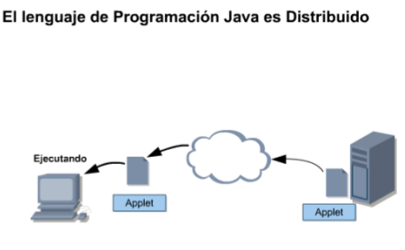

1 Explicando la Tecnología Java
===============================

Este módulo es la introducción al lenguaje Java. Describiremos los conceptos fundamentales del lenguaje de programación Java, aprenderemos de los tres grupos de productos de tecnología Java y resumiremos sus etapas de ciclo de vida.

1.1 Objetivos
+++++++++++++

una vez finalizado este módulo, usted será capaz de:

Describir los conceptos fundamentales del lenguaje de programación Java.
Listar los tres grupos de productos de tecnología Java.
Resumir cada una de las siete etapas del ciclo de vida de un producto.

Este módulo ofrece una visión general de la tecnología Java, de la programación basada en la tecnología Java y el ciclo de vida del desarrollo de una aplicación.

1.2 Verificación del Progreso
++++++++++++++++++++++++++++++

Debe calificar su capacidad para llevar a cabo cada uno de los objetivos de este módulo. Una vez que haya finalizado este módulo, usted deberá reevaluar sus capacidades y determinar el aprendizaje adquirido por cada objetivo.

+-------------------------+--------------+--------------+
| Objetivo del modulo     | Al comenzar  | Al finalizar |
+-------------------------+--------------+--------------+
| Describir los conceptos |		 |		|
| fundamentos del lenguaje|	 	 |		|
| de programación Java	  |		 |		|
+-------------------------+--------------+--------------+
| Listar los tres grupos  | 		 |		|
| productos de la 	  |		 |		|
| tecnología Java	  |		 |		|
+-------------------------+--------------+--------------+
| Resumir cada una de las |		 |		|
| siete etapas del ciclo  |		 |		|
| de vida de un producto  |		 |		|
+-------------------------+--------------+--------------+

1.3 Relevancia
+++++++++++++++

Discusión - las siguientes preguntas son relevante para comprender de qué se trata la tecnología Java:
¿ Cuál es su definición para las siguientes palabras ?

Seguridad.
Orientado a Objetos.
Independencia.
Dependencia.
Distribución.

¿ Cuáles son las etapas comprendidas en la construcción de alguna cosa, como por ejemplo una casa, un mueble ?

1.4 Recursos Adicionales
++++++++++++++++++++++++

Recursos adicionales - Las siguientes referencias proporcionan información adicional sobre los temas descriptos en este módulo:

The Java Tutorial. (Online). Disponible en:
https://docs.oracle.com/javase/tutorial/
Una guía práctica para programadores con cientos de ejemplos completos y en funcionamiento.

1.5 Conceptos Fundamentales del Lenguaje de Programación Java
+++++++++++++++++++++++++++++++++++++++++++++++++++++++++++++

El lenguaje de programación Java se originó en 1991 como parte de un proyecto de investigación para desarrollar un lenguaje de programación, llamado "OAK" que permitiera hacer un puente para disminuir la brecha de comunicación entre varios tipos de dispositivos electrónicos, como por ejemplo reproductores de video casettes (VCR) y televisores. Especificamente, un equipo de desarrolladores de software altamente calificado (denominado equipo VERDE), quería crear un lenguaje de programación que permitieran a los dispositivos electrónicos con distintas unidades centrales de proceso (CPU) compartir los mismos beneficios del software.

El concepto inicial falló después de varios intentos con las compañías de fabricantes de dispositivos electrónicos. El equipo VERDE fue entonces orientado a buscar otro mercado para el nuevo lenguaje de programación. Afortunadamente, comenzó la popularidad del World Wide Web y el equipo reconoció que el lenguaje OAK era perfecto para desarrollar componentes multimedia para mejorar las paginas Web. Estas pequeñas aplicaciones, denominadas applets, constituyeron el primer uso del lenguaje OAK y los programadores, usuarios de Internet adoptaron lo que se constituiría en el lenguaje de programación Java.

El lenguaje de programación Java fue diseñado para ser:

Orientado a Objetos.
Distribuido.
Simple.
Multihilo.
Seguro.
Independencia de plataforma.

1.5.1 Orientado a Objetos
+++++++++++++++++++++++++

El lenguaje de programación Java es un lenguaje de programación orientado a objetos (POO) porque uno de los principales objetivos del programador en tecnologías Java es crear objetos, fragmento de código autónomo, que puedan interactuar con otros objetos para resolver un problema. La POO comenzó con el lenguaje de programación SIMULA-67 en 1967 y condujo a la creación de otros lenguajes de programación populares, como C++, **en el que el lenguaje de programación Java está basado**.

La POO difiere de la programación procedural en que esta última hace hincapié en la secuencia de los pasos requeridos para resolver un problema, mientras que la POO hace hincapié en la creación y la interacción de los objetos.

La figura demuestra un Programa Procedural con el foco puesto en una secuencia.

La figura ilustra un programa orientado a objetos, cuyo foco está puesto en los objetos y la interacción entre ellos.

1.5.2 Distribuido
+++++++++++++++++

El lenguaje de programación Java es distribuido porque ofrece soporte para tecnología de redes distribuidas, tales como Remote Method Invocation (RMI).

Common Object Request Broker Architecture (CORBA), y  Universal Resource Locator (URL)

Adicionalmente, la capacidad de carga dinámica de clases de la tecnología Java permite que fragmentos de código sean descargados a través Internet y ejecutados sobre un computador personal.

Tips
	Los términos "tecnología Java" y "Lenguaje de programación Java" no se refieren al mismo concepto. El termino "tecnología Java" se refiere a la familia de productos Java y el lenguaje de programación es sólo una parte de ella.

La figura ilustra la propiedad de distribución de la tecnología Java.

1.5.3 Simpre
++++++++++++++

El lenguaje de programación Java es simple debido que sus diseñadores quitaron algunas de las construcciones complejas y poco claras que se encuentran en otros lenguajes de programación populares.

Por ejemplo, el lenguaje de programación Java no permite que los programadores puedan manipular directamente punteros a ubicaciones de memoria, lo que constituye una característica compleja de los lenguajes de programación C y C++, que frecuentemente es mal usada.

En cambio, el lenguaje de programación Java sólo permite a los programadores manipular objetos usando referencias a objetos. El lenguaje de programación utiliza también una característica denominada **garbage collector** para controlar y eliminar aquellos objetos que ya no están referenciados.

Otra característica que hace simple al lenguaje de programación Java es que un tipo de datos boolean pueden tener un valor true (verdadero) o false (falso), a diferencia de otros lenguajes de programación donde el valor también puede ser 1 o 0.

1.5.4 Multihilo
++++++++++++++++

El lenguaje de programación Java ofrece facilidades de multihilo, esto es, realizar varias tareas al mismo tiempo, tales como consultar una base de datos y desplegar una interfaz de usuario. La tecnología multihilo posibilita que un programa basado en la tecnología Java sea muy eficiente en el uso que hace de los recursos del sistema.

La siguiente figura ilustra por qué el lenguaje de programación Java es Multihilo.

1.5.5 Seguro
+++++++++++++

Los programas basados en la tecnología Java son seguros debido a que el lenguaje de programación Java, junto al entorno en el cual estos programas ejecutan, utilizan medidas de seguridad para proteger los programas de ataques externos. Estas medidas incluyen:

Prohibir el manejo de la memoria usando punteros.
Prohibir a los programas distribuidos, tales como los applets, leer y escribir a un disco duro de una computadora.
Verificar que todos los programas basados en tecnología Java contienen código válido.
Soporta firmas digitales. El código basado en la tecnología Java puede ser "firmado" por una compañía o por una persona de forma tal que otra persona que recibe el código pueda verificar la legitimidad del mismo.

